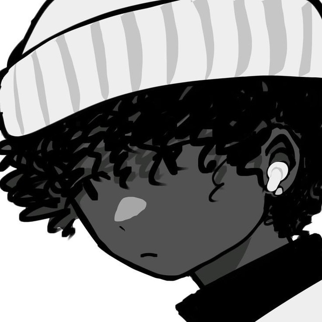

    

# **Hola, soy Ray** - Full-stack Python Developer

    
Creo experiencias digitales sin costuras - desde landing pages elegantes y aplicaciones web dinámicas en el frontend, hasta bots poderosos, bibliotecas y características escalables en el backend.

Creo que el desarrollo web es una forma de arte, y como tal, cada proyecto debe ser una obra maestra. Con más de 4 años en el mundo del desarrollo, he crecido desde aprender Python desde cero hasta dominarla como mi lenguaje principal, explorando y construyendo constantemente soluciones de impacto.

### **Tecnologías que domino**

    

        
        
        
        
    

### **Trabajos que acepto**

- Dise o de logos, banners, portadas para tu negocio.
- Crear una web, landing page o e-commerce.
- Bots de Telegram para negocios, automatizaciones, etc.